<!-- An orrery: a clockwork model of a star system — many bodies, each on its own
     orbit, all legible at a glance. -->

  

<h1 align="center">Project Orrery</h1>

An orrery is a clockwork model of a star system: many bodies, each on its own orbit, all legible at a glance. Project Orrery is that model for AI agents — an open-source platform for running an org of accountable agents you can watch, verify, and make your own.

<strong>Every action an agent takes is signed, and verifiable by anyone, offline.</strong>

Orrery is an open-source platform for standing up an **org** that hosts a fleet of
**agents** acting on people's behalf, where the question *"what did the agent do, and
can I prove it?"* is answered by cryptography rather than trust. Each agent has a
clean, themeable UI by default, and can generate its own UI from intent when you opt
in.

Built on the NANDA Chapter Protocol and the
[`sm-*` trust stack](https://github.com/Sharathvc23/sm-arp). Apache-2.0.

> **Status: assembling.** The implementations are in place; the wiring that makes
> them run as one product — build, configuration, tests — is in progress. This
> document describes what Orrery is, not a deployment you can run unattended today.

---

## Why

Most "Internet of Agents" tooling assumes a reliable cloud and low-stakes consumer
tasks, and stops at getting agents to communicate. Orrery addresses the other case:
an org running agents that **do things for people**, where every action must be
provable offline, by anyone, with no service on the path.

Where other tooling teaches agents to talk and act, Orrery adds the layer that makes
their actions accountable, and ships it as software you install rather than as a
specification you implement yourself.

## What's included

### 🏛️ The org server — hosts many agents under one roof
- Multi-agent org runtime with a structured think/act loop
- Org provisioning: name your org and set its identity and branding at install
- REST and agent-to-agent (A2A) transport; MCP tool integration
- Federation: peer discovery, cross-org sync, and publishing to agent registries

### 🤖 Sovereign agents — each person owns theirs
- `did:key` identity backed by a real keystore (OS keychain or encrypted file)
- Signed requests, signed action receipts, and a local hash-chained activity log
- An LLM planner with a bring-your-own provider (OpenAI, Anthropic, xAI, Ollama)
- A consent-gated action sandbox for browser, desktop, shell, files, and network
- Skills you can install, run, and publish — sandboxed, with revocation
- A drop-in skill so any **OpenClaw** agent can join an org, plus a desktop app and web UI

### 🔐 Accountability and trust
- Signed receipts that are offline-verifiable, hash-chained, and portable
- The Chronicle: an agent's first-person, receipt-backed public record
- Human oversight: approve, deny, or escalate, with M-of-N quorum and a consent ledger
- Reputation scoring with Sybil resistance and duress detection
- Conformance badges that anyone can re-verify offline; enterprise audit via Merkle
  checkpoints and DSAR/compliance export
- Governance: approval queues, policy auto-tuning, and time-bounded authority

### 🎨 Generative UI
- An A2UI renderer with AG-UI streaming surfaces
- A deterministic, themeable shell by default, which runs offline and needs no key
- Agents that render their own UI from intent once you supply a model key, with a
  safe fallback to the default shell

### 💱 An agent economy
- A skills marketplace and revenue tracking, with receipts as value-bearing assets

## Relationship to the `sm-*` primitives

Orrery is the assembled product; the
[`sm-*` libraries](https://github.com/Sharathvc23/sm-arp) — signed receipts,
conformance badges, and the rest of the trust stack — are the components it is built
from. Install one component on its own if that is all you need, or run Orrery to get
the whole org. No protocol lives only here; new primitives get their own `sm-*` repo.

## The animation

The banner is a working clockwork model, not a recorded clip — a self-contained
animated SVG, pure [SMIL](https://developer.mozilla.org/en-US/docs/Web/SVG/SVG_animation_with_SMIL)
with no JavaScript, rendered offline:

- **Radii** are the planets' real semi-major axes in AU, square-root-compressed so
  the inner worlds do not collapse into the Sun and Neptune still fits the frame.
- **Periods** are recomputed from the displayed radii using Kepler's third law
  (`T ∝ R^1.5`), so the rendered system is an internally consistent Kepler model —
  scaled rather than slowed. (Neptune's true 165-year orbit would otherwise appear
  frozen.) Each body is lit from the Sun; Earth carries a Moon and Saturn its rings.

The construction mirrors the product: signed, deterministic, and verifiable offline
with no service on the path.

## License

Apache-2.0 — see [LICENSE](LICENSE). The `sm-*` primitives remain MIT.

---

Part of the [Stellarminds.ai](https://labs.stellarminds.ai) work on the Enterprise Internet of Agents · aligned with [Project NANDA](https://projectnanda.org).
