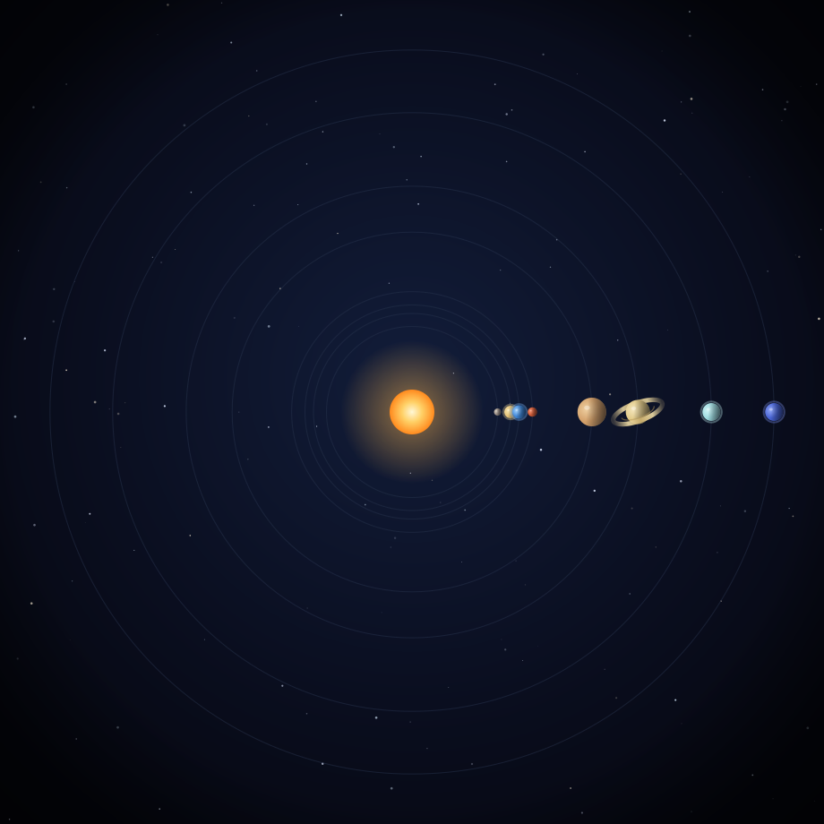

<!-- An orrery: a clockwork model of a star system — many bodies, each on its own
     orbit, all legible at a glance. -->

  

<h1 align="center">Project Orrery</h1>

An orrery is a clockwork model of a star system: many bodies, each on its own orbit, all legible at a glance. Project Orrery is that model for AI agents — an open-source platform for running an org of accountable agents you can watch, verify, and make your own.

<strong>Every action an agent takes is signed, and verifiable by anyone, offline.</strong>

Orrery is an open-source platform for standing up an **org** that hosts a fleet of
**agents** acting on people's behalf, where the question *"what did the agent do, and
can I prove it?"* is answered by cryptography rather than trust. Each agent has a
clean, themeable UI by default, and can generate its own UI from intent when you opt
in.

Built on the Project NANDA stack + Stellarminds open source libraries 

                                              Apache-2.0.

> **Status: it runs.** The org server boots, agents register and sign, and the full
> stack comes up under `docker compose` / `./orrery-up` — exercised end to end in CI
> on every change. Some capabilities are opt-in or preview; the status table below
> says exactly which.

---

## Why

Most "Internet of Agents" tooling assumes a reliable cloud and low-stakes consumer
tasks, and stops at getting agents to communicate. Orrery addresses the other case:
an org running agents that **do things for people**, where every action must be
provable offline, by anyone, with no service on the path.

Where other tooling teaches agents to talk and act, Orrery adds the layer that makes
their actions accountable, and ships it as software you install rather than as a
specification you implement yourself.

## What's included

### 🏛️ The org server — hosts many agents under one roof
- Multi-agent org runtime with a structured think/act loop
- Org provisioning: name your org and set its identity at install
- REST and agent-to-agent (A2A) transport
- Federation: publishes to agent registries out of the box, with opt-in peer discovery and cross-org sync

### 🤖 Sovereign agents — each person owns theirs
- `did:key` identity backed by a real keystore (OS keychain or encrypted file)
- Ed25519-signed requests, signed action receipts, and a local hash-chained activity log
- An LLM planner with a bring-your-own provider (OpenAI, Anthropic, xAI, Ollama)
- A consent-gated action layer for browser, desktop, shell, files, and network — capability-scoped, with per-action approval
- Skills you can install, run, and publish — capability-gated, with revocation
- A drop-in skill so any **OpenClaw** agent can join an org, plus a reference web renderer you point at the agent's API

### 🔐 Accountability and trust
- Signed receipts that are offline-verifiable, hash-chained, and portable
- The Chronicle: an agent's first-person, receipt-backed public record
- Human oversight: approve, deny, or escalate to the owner, with a hash-chained consent ledger
- Reputation scoring with counterparty corroboration, Sybil-ring detection, and duress detection
- Conformance badges that anyone can re-verify offline; enterprise audit via Merkle
  checkpoints and DSAR export
- Governance: approval queues, bounded policy auto-tuning, and time-bounded authority

### 🛰️ Accountable discovery — the part nobody else has
- Self-certifying signed registry records, offline-verifiable
- DID pinning (trust-on-first-use) with tamper alerts
- Cross-registry divergence detection: your orgs cross-check each other's identity records and flag a lying registry
- A lean, NANDA-compatible index as a second corroboration source

### 🎨 Generative UI
- An A2UI renderer with AG-UI streaming surfaces
- A deterministic, themeable shell by default, which runs offline and needs no key
- Agents that render their own UI from intent once you supply a model key, with a
  safe fallback to the default shell

### 🏪 Small business — an agent without infrastructure
- One call stands up a sovereign agent for a business that runs nothing: identity minted, agent card served, no DNS and no server of its own
- Every booking emits a signed receipt the customer verifies **offline, in their own browser** — a tampered one is rejected
- Each business is isolated in a shared runtime: its own identity, keystore and card
- The public listing is authorised by an **owner principal** whose key the runtime never holds
- Orrery mints and serves; registering the agent on the public NANDA Index is the card host's step, not ours

### 💱 Agent economy (preview)
- A signed skills registry, with a test-currency revenue ledger — the accounting is real; payment rails are on the roadmap

## Status at a glance

Every capability above, and exactly where it stands. **✅ live · ◐ opt-in / partial · ⚗️ preview · ✂️ out of scope.**

| Area | Capability | Status |
| --- | --- | --- |
| **Org server** | Multi-agent runtime + think/act loop · REST + A2A transport | ✅ |
| | Org provisioning (name + identity, at install) | ✅ |
| | Federation — publish to registries | ✅ |
| | Federation — peer discovery + cross-org sync | ◐ opt-in |
| | MCP tool integration | ✂️ composes MCP as a complement; not embedded |
| **Sovereign agent** | `did:key` + real keystore (keychain / encrypted file) | ✅ |
| | Ed25519-signed requests · signed receipts · hash-chained log | ✅ |
| | LLM planner, bring-your-own provider (keyless OK) | ✅ |
| | Consent-gated actions (browser/desktop/shell/files/net) | ✅ capability-gated, not OS-isolated |
| | Skills: install / run / publish / revoke | ✅ capability-gated |
| | OpenClaw drop-in skill | ✅ |
| | Desktop app / bundled web UI | ✂️ headless; BYO reference renderer |
| **Accountability** | Offline-verifiable, hash-chained, portable receipts · Chronicle | ✅ |
| | Human oversight: approve / deny / escalate + consent ledger | ✅ (quorum 1-of-1) |
| | Multi-party (M-of-N) consent quorum | ✂️ out of scope |
| | Reputation (corroborated) + duress detection | ✅ |
| | Sybil-ring detection | ◐ audit-only |
| | Conformance badges (offline) · Merkle checkpoints · DSAR export | ✅ |
| **Accountable discovery** | Signed registry records · DID pinning · divergence detection · lean index | ✅ |
| **Generative UI** | A2UI renderer + AG-UI streaming · deterministic keyless shell | ✅ |
| | Agent-composed UI from intent (key-gated, safe fallback) | ◐ |
| **Small business** | Provision an agent with no infra · isolated per business | ✅ |
| | Signed booking receipts · offline verify in the browser | ✅ |
| | Owner principal authorises the listing (key never held by the runtime) | ◐ OIDC path needs the `owner` extra |
| | Domain-control proof for domain-owning businesses | ◐ DNS-01 needs the `domain` extra; HTTP-01 does not |
| | Listed on the public NANDA Index | ⚗️ needs the card host's half — not built by anyone yet |
| **Economy** | Signed skill registry (publish / install / review) | ✅ free installs |
| | Revenue ledger | ⚗️ test currency; settlement on the roadmap |
| | Receipts as tradeable / financial assets | ✂️ reputation-bearing, not financial |

## Relationship to the `sm-*` primitives

Orrery is the assembled product; the
[`sm-*` libraries](https://github.com/Sharathvc23/sm-arp) — signed receipts,
conformance badges, and the rest of the trust stack — are the components it is built
from. Install one component on its own if that is all you need, or run Orrery to get
the whole org. No protocol lives only here; new primitives get their own `sm-*` repo.

## The animation

The banner is a working clockwork model, not a recorded clip — a self-contained
animated SVG, pure [SMIL](https://developer.mozilla.org/en-US/docs/Web/SVG/SVG_animation_with_SMIL)
with no JavaScript, rendered offline:

- **Radii** are the planets' real semi-major axes in AU, square-root-compressed so
  the inner worlds do not collapse into the Sun and Neptune still fits the frame.
- **Periods** are recomputed from the displayed radii using Kepler's third law
  (`T ∝ R^1.5`), so the rendered system is an internally consistent Kepler model —
  scaled rather than slowed. (Neptune's true 165-year orbit would otherwise appear
  frozen.) Each body is lit from the Sun; Earth carries a Moon and Saturn its rings.

The construction mirrors the product: signed, deterministic, and verifiable offline
with no service on the path.

## License

Apache-2.0 — see [LICENSE](LICENSE). The `sm-*` primitives remain MIT.

---

Part of the [Stellarminds.ai](https://labs.stellarminds.ai) work on the Enterprise Internet of Agents · aligned with [Project NANDA](https://projectnanda.org).
